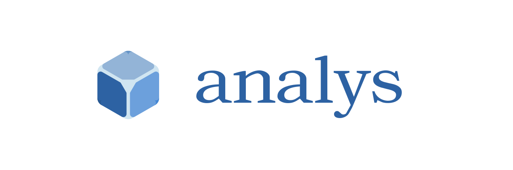

<div align="center">
  
  <p align="center">cross-table analytics</p>
</div>

[]()
[][url-github]
[][url-github]
[]()
[][url-github]
[][url-github]
[]()
[]()
[]()

[//]: <> (Link)

[url-github]: https://github.com/hoyeungw/analys
[url-npm]: https://npmjs.org/package/@analys/vector

#### Features

- Cross-table analysis from table or samples.
- Sort / filter / select fields on samples/table/crostab.
- Intersect or union tables.

#### Install

```console
$ npm install @analys/<tool-name>
```

#### Tools

|                                                                 |                                           |                 |                             |
|-----------------------------------------------------------------|-------------------------------------------|-----------------|-----------------------------|
| [**table**](packages/core/table)                                | Table (of head and rows)                  | core            | ![v][table-dm]              |
| [**crostab**](packages/core/crostab)                            | Crostab (of side, head and rows)          | core            | ![v][crostab-dm]            |
| [**samples**](packages/core/samples)                            | Samples (list of object)                  | core            | ![v][samples-dm]            |
| [**data-gram**](packages/core/data-gram)                        | Data-gram (of side, head and rows)        | core            | ![v][data-gram-dm]          |
| [**convert**](packages/core/convert)                            | Convert between samples and table         | convert         | ![v][convert-dm]            |
| [**tablespec**](packages/infrastructure/tablespec)              | Defines how to query for crostab          | query interface | ![v][tablespec-dm]          |
| [**table-join**](archive/table-join)                            | Join tables by union/intersect/left/right | table           | ![v][table-join-dm]         |
| [**cubic**](archive/cubic)                                      | Crostab engine for combined query         | util            | ![v][cubic-dm]              |
| [**pivot**](archive/pivot)                                      | Crostab engine for single query           | util            | ![v][pivot-dm]              |
| [**enum-pivot-mode**](packages/constants/enum-pivot-mode)       | Pivot modes: INCRE/COUNT/ACCUM            | enum            | ![v][enum-pivot-mode-dm]    |
| [**enum-tabular-types**](packages/constants/enum-tabular-types) | Tabular types: SAMPLES/TABLE/CROSTAB      | enum            | ![v][enum-tabular-types-dm] |
|                                                                 |                                           |                 |                             |

[//]: <> (Local routes)

[table-dm]:              https://flat.badgen.net/npm/dm/@analys/table

[crostab-dm]:            https://flat.badgen.net/npm/dm/@analys/crostab

[samples-dm]:            https://flat.badgen.net/npm/dm/@analys/samples

[data-gram-dm]:            https://flat.badgen.net/npm/dm/@analys/data-gram

[convert-dm]:            https://flat.badgen.net/npm/dm/@analys/convert

[tablespec-dm]:          https://flat.badgen.net/npm/dm/@analys/tablespec

[table-join-dm]:         https://flat.badgen.net/npm/dm/@analys/table-join

[cubic-dm]:              https://flat.badgen.net/npm/dm/@analys/cubic

[pivot-dm]:              https://flat.badgen.net/npm/dm/@analys/pivot

[enum-pivot-mode-dm]:    https://flat.badgen.net/npm/dm/@analys/enum-pivot-mode

[enum-tabular-types-dm]: https://flat.badgen.net/npm/dm/@analys/enum-tabular-types

#### Meta

[LICENSE (MIT)](LICENSE)
