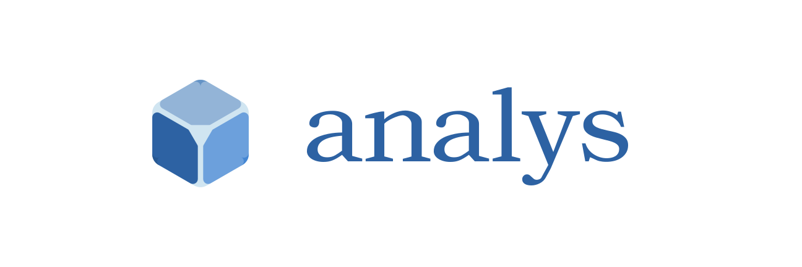

<div align="center">
  
  <p align="center">@analys/crostab - cross-table analytics tool</p>
</div>

[][url-npm]
[]()
[]()
[]()
[]()
[]()
[]()
[]()
[]()
[]()
[]()

[//]: <> (Link)

[url-github]: https://github.com/crostab/analys

[url-npm]: https://npmjs.org/package/@analys/crostab

##### Cross-table analytics tool

#### Features

- ES2015 syntax

#### Install

```console
$ npm install @analys/crostab
```

#### Usage

```js
```

#### Meta

[LICENSE (MIT)](/LICENSE)
